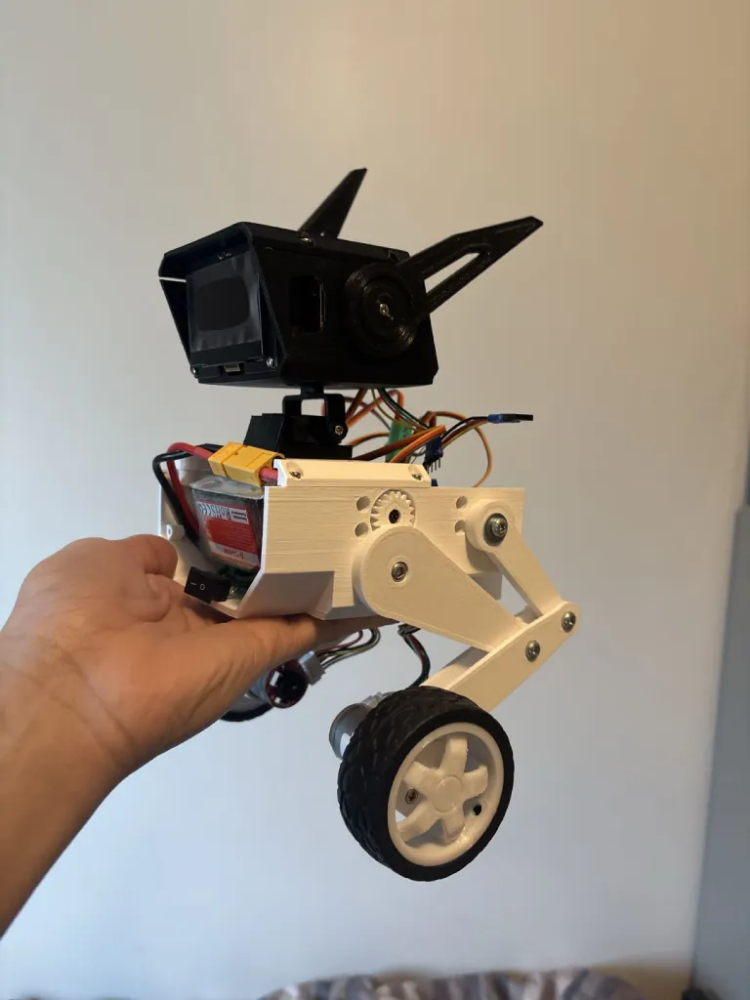
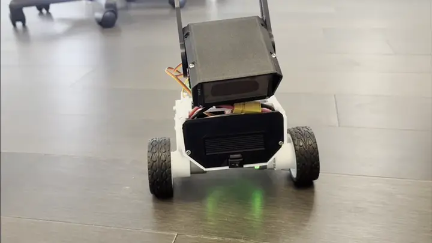
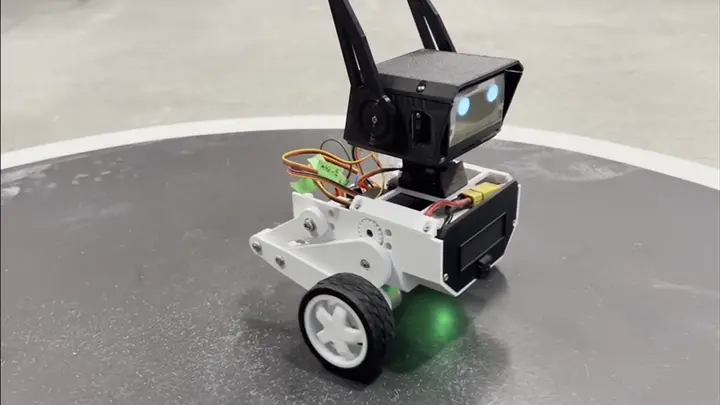

# Balance Bot
This project started around mid 2025. An inverted pendulum or balance bot would be cool to work on.

I added some actuating legs that could extend and change height independently, to add some more dynamic capabilities.

I also added a 2-axis head and a face for personality.

{width=300 height=500 class="mx-auto border border-black"}
{width=300 height=200 class="mx-auto border border-black"}
{width=300 height=200 class="mx-auto border border-black"}

Upcoming upgrades:
* Custom PCB
* BLDC Motors
* Stronger or more compact servos